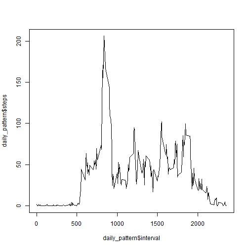
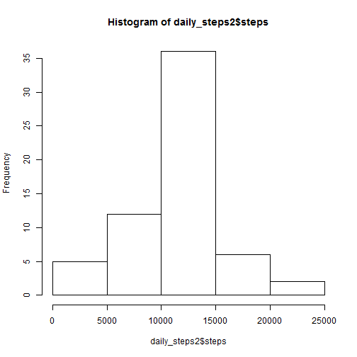
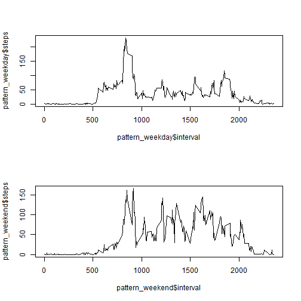

## Loading and preprocessing the data

To begin the analysis, the data must be read in. First, fork and then clone the
Github repository found at https://github.com/rdpeng/RepData_PeerAssessment1. 
Unzip the activity.zip folder to extract the file "activity.csv". The file can
then be read using read.csv().


```r
activity<-read.csv("activity.csv",stringsAsFactors=FALSE)
```

Now is also a good time to make the library calls necessary throughout the analysis


```r
library(dplyr)
```

## What is mean total number of steps taken per day?

Now that the data has been read into R, analysis can begin. The initial analysis
simply involves finding the average number of total steps taken each day. 
Missing values are not included in this measurement.

First, the data is grouped by date.


```r
activity_grouped1<-group_by(activity,date)
```

Next, use summarise_each() to find the total number of steps for each day.


```r
daily_steps1<-summarise_each(activity_grouped1,funs(sum(.,na.rm=TRUE)),steps)
```

Now the steps per day can be plotted as a histogram.This shows the distribution
of steps per day.


```r
hist(daily_steps1$steps)
```

 

For the final part of the initial analysis, the mean and median total steps per
day will be calculated.


```r
mean(daily_steps1$steps,na.rm=TRUE)
```

```
## [1] 9354.23
```

```r
median(daily_steps1$steps,na.rm=TRUE)
```

```
## [1] 10395
```

## What is the average daily activity pattern?

Next, the analysis will look for patterns in the average number of steps for each 
time of day. This is done by grouping the data by interval, finding the mean number
of steps for each 5 minute interval, and plotting the result.


```r
activity_grouped2<-group_by(activity,interval)

daily_pattern<-summarise_each(activity_grouped2,funs(mean(.,na.rm=TRUE)),steps)

plot(daily_pattern$interval,
     daily_pattern$steps,
     type="l")
```

 

Now the analysis will show which 5 minute interval tends to have the most steps on
average for each day. This is found by sorting the daily_patten data by steps 
descending and taking the first row in the resulting data.


```r
head(arrange(daily_pattern,desc(steps)),1)
```

```
## Source: local data frame [1 x 2]
## 
##   interval    steps
## 1      835 206.1698
```

## Imputing missing values

Now the analysis will address the missing values within the data set. The analysis
starts off by counting how many missing values there are.


```r
missing_values<-sum(is.na(activity$steps)==TRUE)
```

Next, the missing values will be replaced with the average number of steps for their
corresponding interval out of the day. This is done by grouping the data by interval,
and then by using mutate() to replace the missing values with the average number of
steps for that interval.


```r
activity_filled<-activity %>%
                      group_by(interval) %>% 
                      mutate(steps=replace(steps,is.na(steps),mean(steps,na.rm=TRUE)))
```

The analysis will now create a new histogram showing the number of steps taken each
day as well as calculate the new mean and median number of steps per day.


```r
activity_grouped2<-group_by(activity_filled,date)

daily_steps2<-summarise_each(activity_grouped2,funs(sum(.,na.rm=TRUE)),steps)

hist(daily_steps2$steps)
```

 

```r
mean(daily_steps2$steps,na.rm=TRUE)
```

```
## [1] 10766.19
```

```r
median(daily_steps2$steps,na.rm=TRUE)
```

```
## [1] 10766.19
```

## Are there differences in activity patterns between weekdays and weekends?

The analysis will now determine how daily activity is affected by whether or not a
day is a weekday or a weekend day. First, a the date variable from the 
activity_filled data set will be converted from a character vector to a date vector.


```r
activity_filled$date<-strptime(activity_filled$date,format="%Y-%m-%d")
```

Now that the date variable has been classified as dates rather than characters, the
day of the week for each date can be determined. Using this, an additional column can
be added to the data set with a factor vector determining whether a date is a weekday
or a weekend day.


```r
activity_filled["day"]<-NA

activity_filled$day<-ifelse(weekdays(activity_filled$date)
                            %in% c('Sunday','Saturday'),"Weekend","Weekday")
```

The analysis will now produce a panel plot showing the average number of steps for
each 5 minute interval on weekends versus weekdays.


```r
activity_filled2<-activity_filled[,c(1,3,4)]

activity_grouped3<-group_by(activity_filled2,interval,day)

daily_pattern2<-summarise_each(activity_grouped3,funs(mean(.,na.rm=TRUE)))

pattern_weekday<-daily_pattern2[daily_pattern2$day=="Weekday",]

pattern_weekend<-daily_pattern2[daily_pattern2$day=="Weekend",]

par(mfrow=c(2,1))

plot(pattern_weekday$interval,
     pattern_weekday$steps,
     type="l")

plot(pattern_weekend$interval,
     pattern_weekend$steps,
     type="l")
```

 
